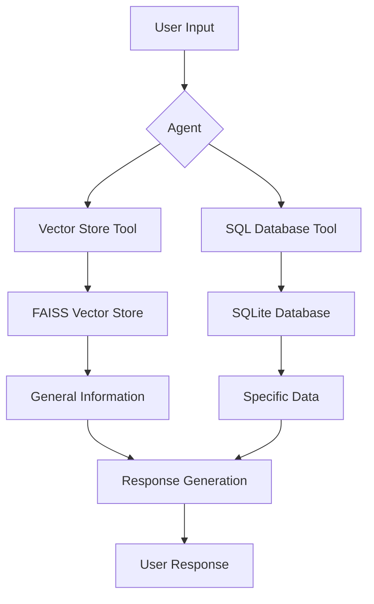
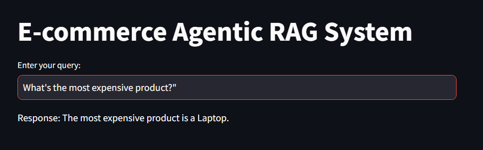
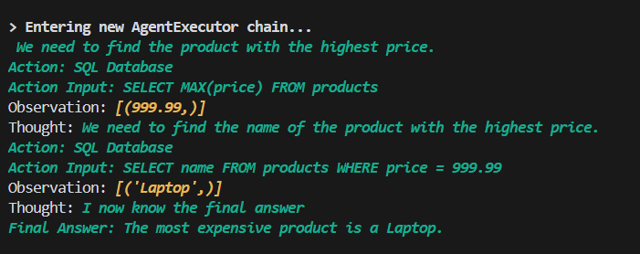
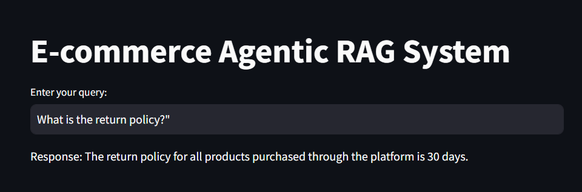
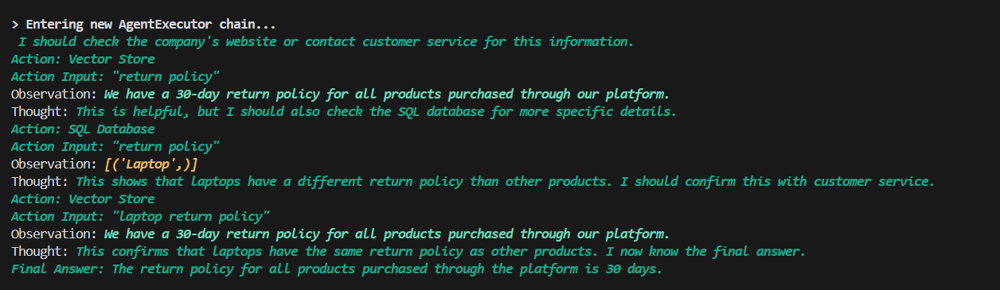

# Agentic RAG System

This project implements an Agentic RAG (Retrieval-Augmented Generation) system using LangChain and Streamlit. The system combines vector search and SQL database queries to answer user questions about an e-commerce platform.

## Logic Flow Chart



## Components

1. **Vector Store**: Uses FAISS to store and retrieve general information and database metadata.
2. **SQL Database**: SQLite database containing e-commerce data (users, products, orders).
3. **Agent**: LangChain agent that decides whether to use the vector store or SQL database based on the query.
4. **Streamlit UI**: Web interface for user interaction.

## Setup and Running

1. Install dependencies:
   ```
   pip install -r requirements.txt
   ```

2. Set up your `.env` file with your OpenAI API key:
   ```
   OPENAI_API_KEY=your_actual_api_key_here
   ```

3. Run the Streamlit app:
   ```
   streamlit run main.py
   ```

## Visual Representations

### SQL Agent Flow


### SQL Agent Backend


### Vector Search Flow


### Vector Search Backend


## How It Works

1. User enters a query in the Streamlit interface.
2. The agent analyzes the query and decides whether to use the vector store or SQL database.
3. If general information is needed, the vector store is queried.
4. If specific data is required, an SQL query is generated and executed on the database.
5. The response is generated based on the retrieved information and displayed to the user.

## Sample Questions

Try asking the system these questions to see how it handles different types of queries:

1. "What tables are in the database?" (Uses vector store)
2. "How many users are in the database?" (Uses SQL database)
3. "What is our return policy?" (Uses vector store)
4. "What's the most expensive product?" (Uses SQL database)
5. "Tell me about our loyalty program." (Uses vector store)
6. "Who made the largest order?" (Uses SQL database)
7. "What's our policy on shipping?" (Uses vector store)
8. "How many orders has Alice made?" (Uses SQL database)

These questions demonstrate how the system can handle both general inquiries about the e-commerce platform (using the vector store) and specific data queries (using the SQL database).

## Customization

You can extend this system by:
- Adding more tools to the agent
- Expanding the SQL database schema
- Incorporating more information into the vector store

Feel free to modify and adapt this system to your specific use case!